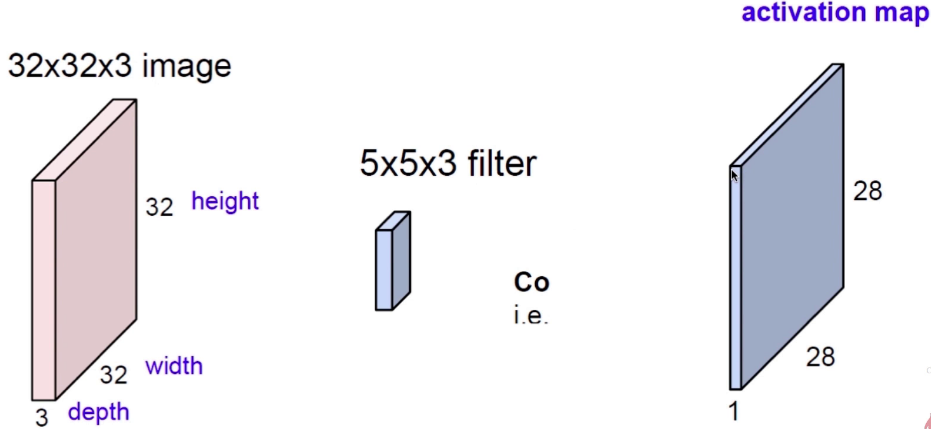
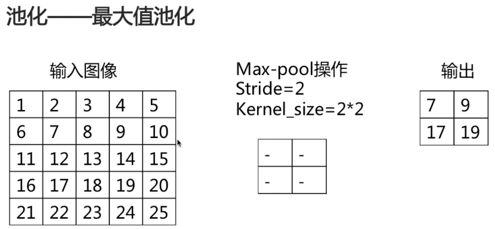
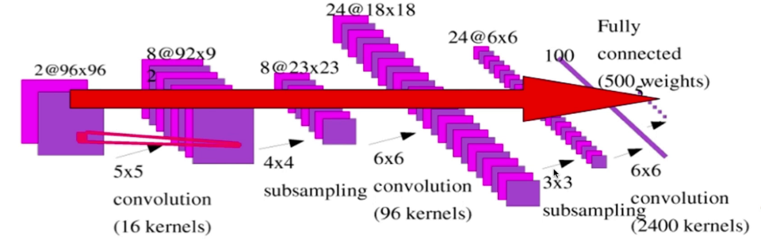
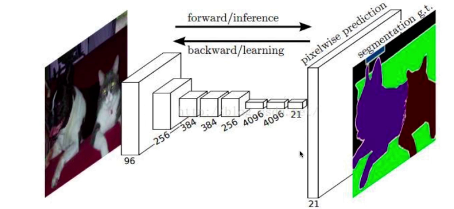

## 卷积神经网络(Cnn)    

### 神经网络遇到的问题   

* 参数过多    

    举例：     

    * 图像大小为`1000*1000`
    * 下一层神经元为`10^6`     
    * 全连接参数为`1000*1000*10^6=10^12`      

    * 容易过拟合，需要更多的训练数据     
    * 收敛到较差的局部极值    

* 卷积———解决问题      

    * 局部连接(稀疏连接)         

        **图像特征是以区域为单位的,像素特征具有局部性,使用全连接的来表达特征,效果并不好**      

             

        下一层神经元中的每个只和图像中的一个区域相连，这个区域是`10*10`的，相当于100个像素      

        * 图像大小为`1000*1000`    
        * 下一层神经元为`10^6`    
        * 局部连接范围为`10*10`     
        * 全连接参数为`10*10*10^6=10^8`     

    * 参数共享       

        **图像的特征和像素的位置是无关的**，如果让每一个神经元去学习一个固定的像素的话，学习到的特征是无意义的，因为像素的位置是会变化的。     

        强制每一个神经元的局部连接都使用同样的参数,这样的话,不管图像中特征的位置如何变换,只要这个特征还在这个图像上,我们使用同样的参数就总是能够将该特征与参数相乘计算出来放到一个输出的图像或者说放到一个输出的神经元上     

        相比于全连接方式中每一个神经元都需要学习一个单独的参数集合而言，在卷积运算中每一层的神经元只需要学习一个卷积核大小的参数集合即可。   


        参数共享对减少参数过多问题的效果     

        * 图像大小为`1000*1000`
        * 下一层神经元为`10^6`     
        * 局部连接范围为`10*10`   
        * 全连接参数为`10*10=100`       

    * 平移等变   

        假设I是一个图像矩阵中的所有数据，其坐标可以用(x, y)来表示，用g表示对一个图像进行平移变换的函数，**平移等变指的是，先对I进行这种平移变换然后再进行卷积操作得到的结果与先对I进行卷积然后再对卷积的结果使用函数g进行平移变换所得到的结果是一样的**    

        参数共享是实现平移等变的一个前提条件，例如对输入的图像使用卷积操作提取边缘特征时，如果使用多个不同的卷积核来处理多个输入的位置，会导致边缘检测的效率降低。        


### 卷积过程的输入输出关系    

`输出size = 输入size - 卷积核size + 1`    

* 步长stride      

    当stride大于一时,会使输出size发生变化    

* padding使输出size不变     

    padding值的确定与卷积核size有关   

    例如:当卷积核size为3时,padding就是1(在图像四侧各补一个零)     
    当卷积核size为5时,padding就是2(相当于在图像周围补两圈零)     

在引入stride和padding后卷积输出size和输入size的关系为:    
`输出size = (n - p) / s + 1`     
n代表输入图像的size,p为padding值,stride为步长     

### 卷积如何处理多通道图像    

当一个图像拥有3个通道时,就可以使用3个卷积核来计算,但是这三个卷积核中的参数是不共享的,当3个卷积核对对应3个通道上的像素值计算完成后,直接图像中对应坐标上3个通道对应卷积运算的结果进行叠加就得到了输出神经元的值     

   

### 卷积如何产生一个多通道的输出神经元   

上面提到对多个通道的图像进行卷积操作可以得到一个通道的输出神经元,如果想要得到多个通道的输出神经元呢     

首先思考一下这样做的物理意义,对一个图像进行卷积操作就相当于在提取特征,如果为了提取某个特征,那么当卷积核滑到该区域时,经过运算后的输出值应该是一个比较大的值,当卷积核滑动到一个不关心的区域时,经过运算后的输出值应该相对来说比较小    

那么如果有一个卷积核的话在一个通道的图像只能提取到一个特征,如果加入多个卷积核就可以得到同一通道中图像中的多个特征,并且每个卷积核对应一个输出,**将这些输出叠加成一个多通道的输出神经元**  

      

### 卷积层的代码实现  

Tensorflow函数原型   
```python
conv2d(input, filter, strides, padding, use_cudnn_on_gpu, data_format, name); 
``` 

* input参数   
    第一个参数为当前卷积层的输入矩阵，这个矩阵应该是一个四维矩阵，赋值的格式应该是一个长度为4的列表，比如[1，32，32，1],其中代表第一个维度的参数对应一个输入batch，第二个和第三个参数对应batch的宽度和高度，第四个参数对应图像的深度   
* filter参数  
    该参数为当前卷积层使用的卷积核，这也是一个四维矩阵，赋值的格式为[3, 3, 3, 64],前两个数值表示卷积核的大小，3x3，第三个数值代表输入矩阵数据的深度，第四个数值为本层过滤器的深度。   
* strides参数   
    该参数指定不同维度上过滤器移动的步长，赋值格式是一个长度为4的列表，比如[1, 2, 2, 1],表示横向和纵向步长都为2，虽然提供了一个长度为4的数组，但是第一个数字和最后一个数字要求一定是1，这是因为卷积层的步长只对矩阵的长和宽有效。   

### 激活函数   

> *为什么要使用激活函数(非线性)函数呢?*    

在神经网络中,上层到下层输出时使用全连接层时,要训练一个参数矩阵,矩阵运算是有线性关系的,如果我们不在多个层级之间设置非线性函数的话,再深层的神经网络也只是相当于有一个很多参数的大矩阵而已     

* Sigmoid   
* tanH   
* ReLU  
    `max(0, x)`     
* Leaky ReLU   
    `max(0.1x, x)`     
* Maxout   
* ELU    
 
### 池化    

* 最大值池化(Max Pooling)     

        

    池化操作中也有一个滑动窗口,但是窗口中是没有参数的,它就相当于是一个选定区域,**池化操作中默认的步长与滑动窗口的size一致**      

* 均值池化     
* 常使用不重叠，不补零(池化核大小默认等于步长)       
    不重叠指池化中滑动窗口每次滑动后覆盖图像的像素中不会出现已经被处理过的像素  

* 没有用于求导的参数(核可以看为是一个空核)     
* 池化层的参数为步长和核大小   
* 用于减少图像尺寸，从而减少计算量    
* 一定程度上解决了平移鲁棒性     
* 损失了空间位置精度(如果使用最大池化，会丢失一些图像细节信息)    
* 池化可以看作是计算量和图像精度的交换   
* 输出尺寸 = n / kernel size

### 全连接层    

* 即普通神经网络的全连接层     

* 将上一层输出展开并连接到每一个神经元上    

    卷积层和池化层的输出都是二维矩阵形式，为了与普通层上的神经元相连，就需要将输入展开成向量形式    

    **这里需要注意，一旦图像被展开，就再也无法加入卷积层或池化层**    

* 相比于卷积层，参数数目较大     

* 参数数目 = Ci * Co      

    * Ci，Co为输入输出神经元数目    

### 卷积神经网络结构       

* 卷积层+池化层+全连接层    

        

    这种结构最后的全连接层输出的是一个向量    

    如果将全连接层去掉，就可以输入图像，输出图像      

* 卷积层+池化层     

        

    这里可以在网络的最后加入一些反卷积层，来将卷积或池化的较小图像结果生成到与输入图像相同的尺寸，就可以完成一些图像的分割任务     

    


