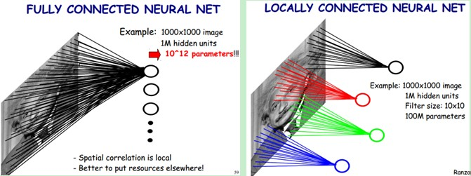

## 卷积神经网络(Cnn)    

### 神经网络遇到的问题   

* 参数过多    

    举例：     

    * 图像大小为`1000*1000`
    * 下一层神经元为`10^6`     
    * 全连接参数为`1000*1000*10^6=10^12`      

    * 容易过拟合，需要更多的训练数据     
    * 收敛到较差的局部极值    

* 卷积———解决问题    

         

    下一层神经元中的每个只和图像中的一个区域相连，这个区域是`10*10`的，相当于100个像素      

    * 图像大小为`1000*1000`    
    * 下一层神经元为`10^6`    
    * 局部连接范围为`10*10`     
    * 全连接参数为`10*10*10^6=10^8`     

    