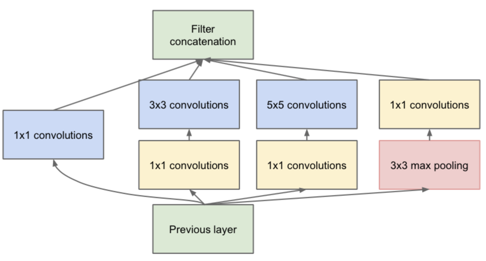

## 卷积神经网络的演变    

LeNet、AlexNet、VGG、ResNet、Inception、MobileNet  

## LeNet(1998)   
LeCun提出，用来解决手写数字识别问题  

## AlexNet(2012)        

* 网络结构    

         

    * 输入为224x224，3通道   
    * 第一层卷积为11x11的卷积，共有48x2个卷积核，stride=4    
    * 第二层卷积为5x5的卷积，共有128x2个卷积    
    * 第二层max_pooling为2x2，(55/27)
    * 在第三层卷积层后，进行两个GPU上输出神经元图的交叉       
    ...      

    * 首次使用ReLU激活函数       
    * 第一层全连接：4096    
    * 第二层全连接：4096  
    * 两个全连接层都使用了dropout      
    * Softmax：1000，计算概率值        
    * dropout = 0.5    
    * batch size = 128   
    * learning_rate = 0.01,过一定的次数降低为1/10    

* 输出神经元图size的计算   

    对第一个卷积层输出计算   

    * 输入大小为224x224    
    * Stride=4,卷积核size为11x11   
    * 输出大小=(输入大小-卷积核size+padding)/stride + 1 = 55  
    *         (224 - 11 + 3) / 4 + 1 = 55    
    * 参数数量: 3 x (11 x 11) x 96 = 35k     

* Dropout      

    在进行fc层连接时，随机的给上层神经元加上一个mask，相当于随机减少参与连接的神经元数量        

    但是在每次训练迭代时，在反向传播计算时，这个随机的mask都会发生变化    
    
        

    * 为什么运用在全连接层上     
        * 全连接层参数占全部参数的大部分，容易发生过拟合   
        * 每次dropout操作都相当于训练了一个子网络，最后的结果相当于很多子网络的组合     
        * 过拟合可以理解为模型记住了数据集的分布，dropout操作消除了神经元之间的依赖关系，增强了模型的泛化能力     
        * 对于dropout操作后的结果，总能找到一个样本与这个结果对应，相当于引入了新的数据(数据增强)    

## VGGNet(2014)      

该网络被提出的目的是为了探究在大规模图像识别任务中，卷积网络深度对模型精确度到底有何影响，它也成为了后续很多网络的backnone(主干网络)   

* 网络结构      

    * 层次更深   
    * 使用2个串联3x3的卷积核代替5x5卷积核     
    * 使用3个串联3x3的卷积核代替7x7卷积核         
    * 多使用1x1的卷积核    
        1x1的卷积层可以看作是非线性变换    
    * 每经过一个pooling层，通道数目翻倍    
        因为经过pooling后，图像尺寸会减小，会丢失信息，所以提高通道数量，对应提取的特征数量会增加，减小信息丢失的程度     

         

* 视野域     

         

    这里可以看作两个3x3的串联卷积得到的效果等同于一个5x5的卷积     

    使用两个串联3x3卷积有什么好处呢    

    * 2层卷积比1层多一次非线性变换    
        多一次非线性变换会影响到最后的拟合效果         
    * 参数数量降低28%     
        局部连接的神经元数量会减少       

* 1x1的卷积层等价于非线性变换     

    使用多通道的1x1的卷积核对输入图像进行操作，当3个卷积核对对应3个通道上的像素值计算完成后,直接图像中对应坐标上3个通道对应卷积运算的结果进行叠加就得到了输出神经元的值，**这个过程可以看作是在通道这个维度上进行的全连接(非线性变换)**      

* LRN       

    归一化操作，LRN考虑的是在同一层次(卷积层或者全连接层，拥有多个通道)中的相邻像素进行归一化操作(均值为0，方差为1)    

    这个方法在AlexNet中有很大的优化作用，但是在其他网络中并没有很大的贡献，而且已经被BatchNormalization和Dropout操作所取代      

## GoogleNet/Inception v1(2014)     
主要考虑增加网络的宽度，将这种宽网络结构定义为Inception结构(一种网中网Network In Network)    

   

* 使用1x1卷积核进行降维(升维)处理     
    极大减少了网络参数数量   

    > 1x1卷积实际上是对多个通道做全连接层(线性组合)，1x1卷积的通道数量代表全连接层的单元数量      

## Inception v2/Inception v3   
* Inception v2 使用两个3x3卷积代替了v1结构中的5x5卷积   

* Inception v3 使用两个nx1、1xn卷积代替了原来结构中的nxn结构    
    比如使用1x3和3x1两个卷积代替了v2结构中的3x3结构，将网络的结构拆解的更加分散    

这样改进的作用可以有效的减少参数量和运算量，同时将大卷积分解成多个小卷积，可以增加模型的非线性能力，因为在每一个卷积之后，都会加上一个激活层，当卷积层增多，激活层也就增多    

## ResNet      

* 网络层次加深的问题    

      

    图中可以看出随着训练迭代次数的增加，56层的网络在训练集上的准确率反而没有20层的网络高，这表明网络层次深度到达一定程度时，训练效果会到达一个瓶颈    

    首先有这样一个假设：深层网络更难优化并非深层网络学不到东西    

* 残差结构   

         

    这个残差单元中，x为原输入，左边为卷积分支，有两个卷积层，右侧为shortcut connections分支，这个分支相当于恒等变换。     

    设原本经过两个卷积层后输出的神经元图为H(x)        

    而两个卷积层的作用为F(x)        

    那得到：   

    $$H(x) = x + F(x)$$     

    这里F(x)被称为残差，当F(x)趋于0时，表明这两个卷积层的作用为恒等变换，与右侧的shortcut connection分支作用一样    

    如果没有这个短路分支的话，这里学习到的特征为`F(x)+x`，**之所以这样这样是因为残差学习相比原始特征直接学习更容易（梯度传递更容易和充分）**,当残差为0时，此时卷积层仅仅做了恒定映射，至少网络性能是不会下降的，实际上残差也不会为0，这也使得卷积层在输入特征基础上学习到了新的特征，从而提高了网络的性能。    

    * 为什么残差学习相对容易：  
        首先直观上残差的值会很小，所以需要学习的内容比较少，所以学习难度会很小。   

        从数学角度分析一下：  

             

        上式第一个因子表示损失函数对L的梯度，括号中的1代表短路机制可以无损的传播梯度，而另外一项残差梯度需要经过带有weights的卷积层，想比短路通路，梯度不是直接传递过来的，而且残差梯度不会都是-1，与短路通路的梯度抵消，就算很小，也不会导致梯度消失，所以残差学习会更加容易。  

        > 从梯度消失的情况来看   
            加入残差后，在计算梯度时，分母需要减去x，这会增大梯度的值，缓解了梯度消失的情况    

* Bottleneck 结构   
    该结构的特点是输入和输出的维度差距较大，像个瓶颈一样，上窄下宽或者上宽下窄,如下为图右侧所示，输入feature map的channel为64，输出channel为256，在网络较深时，这种结构减少了3x3的卷积个数，并使用1x1卷积控制了输入和输出feature map的维度，控制了深层网络的参数数量   
    
       

* Average Pooling代替了FC层   
    在ResNet中去掉了FC层，这极大的减少了参数量    

* Res-Block的用途   

    ResNet除了容易训练外，它常被用作特征映射器，Res-Block中有两个卷积层，且操作步长都为1，这样一个特征向量经过Res-Block运算后，特征向量的shape不会发生变化，我们可以直接将Res-Block看成一个特征向量映射器，随着网络的训练，映射器的映射参数也就被确定下来。   

    Res-Block作为特征映射器还有一个好处，当我们的任务是进行图像风格转换时，使用Res-Block可以防止输入图像特征信息的完全丢失，因为Res——block的输入向量是输入特征和两层卷积操作的加和，这就保证了映射出来的特征向量至少先保留了一定的输入特征向量的分布。       

* ResNet的缺点   
    虽然ResNet可以通过缓解训练过程中的梯度消失来实现非常深层次的网络，但是它仍然是一个大型网络，参数量和计算量仍然非常大，部署在嵌入式和移动平台上的效果仍然是不理想的   

    同时，因为Res-Block需要执行一次残差和原始feature map的加法操作，所以每次推理或者bp时都需要缓存一次原始feature map，这也是一项额外的内存消耗，所以在实际部署使用ResNet时也要考虑额外的内存情况      

* ResNet的变种网络   
    * ResNeXt(分组卷积)   
    * DenseNet(加入了更多的short cut)      
    * Wide-ResNet(加大网络宽度)   
    * ResNet In ResNet(网中网结构)   
    * Inception-ResNet(Inception结构)    

## MobileNet(2017)    
使用深度、宽度可分离卷积(对输入图像的channel进行分组)的方式代替传统卷积，以达到减少网络权值参数的目的   

* Depthwise Convolution   
      
    将一个标准卷积核按照channel数量进行分组和拆分   

* Pointwise Convolution    
      
    将一个标准卷积核的size缩减为1x1卷积，称为点卷积      

## ShuffleNet  
旷世科技提出，使用深度卷积(Depthwise Convolution)代替标准卷积，同时在进行卷积操作之前，对输入数据channel进行shuffle，这样可以学习到图像通道间的联系    

## ShuffleNet v2   
旷世科技针对ShuffleNet改进的轻量级卷积神经网络，该网络发表在ECCV2018    

该模型最大的贡献是提出和分析了如何设计轻量级卷积神经网络的标准和规范   

* 相同的通道宽度可以最小化内存访问成本(MAC)   
    在设计卷积层的通道数量时，应尽可能的统一channel数量   

* 过度的分组卷积会增加(MAC)     
* 网络碎片化(GoogleNet中的inception结构)会降低并行效率   
* 像素级运算不可忽视(如ResNet中的short cut相加操作)   

        
## 参考   

[你必须要知道CNN模型：ResNet](https://zhuanlan.zhihu.com/p/31852747)   

       

    

