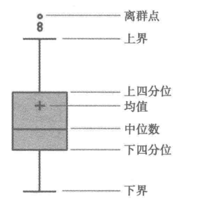

## Pandas   
Pandas基本数据结构是`Series`和`DataFrame`，Series就是序列，类似于一维数组，也可以认为数据库中一张表中的一个元组。   

DataFrame就相当于是一张二维表格，就可以对应到数据库中的一张表，它的每一行或者每一列都是由若干个元组(Series)构成。为了定位到Series中的元素，Pandas提供了Index对象，每个Series都会带有一个对应的Index，用来标记不同的元素，类似于数据库中每个元组的主码   


## 异常值分析   

* 箱型图分析   

    异常值通常被定义为小于`Ql - 1.5IQR`或者大于`Qu + 1.5IQR`的值，Ql称为下四分位数，表示全部数据中有四分之一的数据取值比它小。    

    Qu称为上四分位数，表示全部观察值中有四分之一的数据取值比它大，IQR称为四分位数间距，是Ql和Qu的差值，其间包含了全部观察值的一半，**该差值越大表示数据的变异程度越大**     

    计算一组数据的四分位数间距   

    ```python
    import pandas as pd

    catering_sale = '../data/catering_sale.xls'  # 餐饮数据
    data = pd.read_excel(catering_sale, index_col=u'日期')  # 读取数据，以日期列为索引(主码)列
    data = data[(data[u'销量'] > 400) & (data[u'销量'] < 5000)]  # 过滤异常数据
    statistics = data.describe()  # 保存基本统计量

    # pd.loc函数用来提取对应数据
    statistics.loc['range'] = statistics.loc['max'] - statistics.loc['min']  # 求数据的极差
    statistics.loc['var'] = statistics.loc['std'] / statistics.loc['mean']  # 变异系数
    statistics.loc['dis'] = statistics.loc['75%'] - statistics.loc['25%']  # 四分位数间距

    print(statistics)
    ```

       

## 贡献度分析   

又称为帕累托分析，原理为二八定律，**同样的投入放在不同的地方会产生不同的效益，比如对一个公司来讲，80%的利润常常来自于20%最畅销的产品，其他80%的产品只产生了20%的利润**     

## 相关性分析   
分析连续变量之间线性相关程度的强弱   

* 绘制散点图
    
* 绘制散点图矩阵   
    
    需要同时考虑多个变量间的相关关系时，一一绘制它们间的简单散点图比较麻烦，可以利用散点图矩阵同时绘制各变量之间的散点图，从而快速发现多个变量之间的主要相关性，进行多元线性回归时比较重要   

* 计算各产品之间的相关性   
    可以发现各产品之间的联系    
    ```python
    # 各菜品之间的销售量相关性分析
    import pandas as pd

    catering_sale = '../data/catering_sale_all.xls'  # 餐饮数据，含有其他数据
    data = pd.read_excel(catering_sale, index_col=u'日期')  # 以日期为索引列

    print(data.corr())  # 相关系数矩阵，给出任意两种菜品的之间的相关系数
    print(data.corr()[u'百合酱蒸凤爪'])  # 只显示该菜品与其他菜品的相关系数
    print(data[u'百合酱蒸凤爪'].corr(data[u'铁板酸菜豆腐']))
    ``` 

    第二种方式相关系数计算结果    
    ```
    [10 rows x 10 columns]
    百合酱蒸凤爪     1.000000
    翡翠蒸香茜饺     0.009206
    金银蒜汁蒸排骨    0.016799
    乐膳真味鸡      0.455638
    蜜汁焗餐包      0.098085
    生炒菜心       0.308496
    铁板酸菜豆腐     0.204898
    香煎韭菜饺      0.127448
    香煎罗卜糕     -0.090276
    原汁原味菜心     0.428316
    Name: 百合酱蒸凤爪, dtype: float64
    ```
