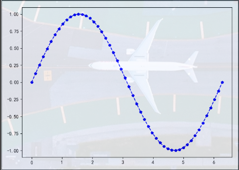
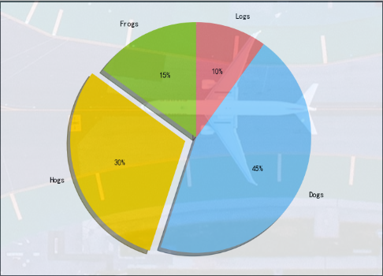
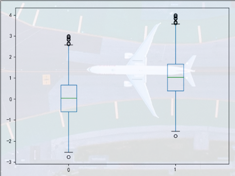
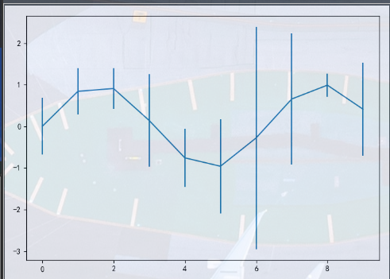

## 统计作图函数  
使用Matplotlib结合Pandas绘图   

在作图之前，通常需要加载一下代码：  

```python  
import matplotlib.pyplot as plt 
plt.rcParams['font.sans-serif'] = ['SimHei'] # 用来正常显示中文标签
plt.rcParams['axes.unicode_minus] = False # 用来正常显示负号
plt.figure(figsize=(7,5)) # 创建图像区域，指定比例   
```

* plot绘制线性二维图，折线图   

    ```python
    plt.rcParams['font.sans-serif'] = ['SimHei']  # 正常显示中文标签
    plt.rcParams['axes.unicode_minus'] = False  # 正常显示负号
    plt.figure(figsize=(7, 5))

    # 绘制一条蓝色的正弦虚线，并在每个坐标点上标上五角星
    # x坐标范围为0 ~ 2pi
    x = np.linspace(0, 2 * np.pi, 50)  # x坐标的输入,等差数列
    y = np.sin(x)
    plt.plot(x, y, 'bp--')  # 图形显示格式为蓝色带星虚线
    plt.show()
    ``` 

        


* pie绘制饼图   

    ```python
    # 通过向量[15, 30, 45, 10]画饼图，标上标签，并将第二部分突出显示
    labels = 'Frogs', 'Hogs', 'Dogs', 'Logs'  # 定义标签
    sizes = [15, 30, 45, 10]  # 每一块的比例
    colors = ['yellowgreen', 'gold', 'lightskyblue', 'lightcoral']  # 每一块的颜色
    explode = (0, 0.1, 0, 0)  # 突出显示,参数越大表示该块图分离程度越大
    # 第一个参数sizes为各块的比例
    plt.pie(sizes, explode=explode, labels=labels, colors=colors, autopct="%1.lf%%",
            shadow=True, startangle=90)
    plt.axis('equal')  # 显示为等圆
    plt.show()
    ```   

      

* hist绘制二维条形直方图   

    ```python
    # 随机生成1000个元素的服从正态分布的数组，分成10组绘制直方图

    x = np.random.randn(1000)  # 1000个服从正态分布的数据
    plt.hist(x, 10)  # 分成10组进行绘制
    plt.show()
    ``` 

* boxplot绘制箱型图   

    ```python
    # 样本由两组正态分布的随机数据构成，其中一组均值为0,标准差为1，另一组数据均值为1，标准差为1
    x = np.random.randn(1000)  # 生成1000个符合正态分布的数据
    D = pd.DataFrame([x, x + 1]).T  # 构造两列的DataFrame
    D.plot(kind='box')  # 调用Series内置的方法作图，kind参数指定为箱型图
    plt.show()
    ```  

       

* D.plot(yerr=error)绘制误差条形图     

    D为Pandas的DataFrame或者Series,代表着均值数据列，error是误差列，该命令在y轴方向画出误差棒图，如果将yerr改为xerr，则在x方向绘制   
    ```python
    # 误差列数据为符合正太分布的10个数
    # 均值数据列为x为从0到9的正弦函数
    error = np.random.randn(10)  # 定义误差列
    y = pd.Series(np.sin(np.arange(10)))  # 均值数据列
    y.plot(yerr=error)
    plt.show()
    ```  

      

    
