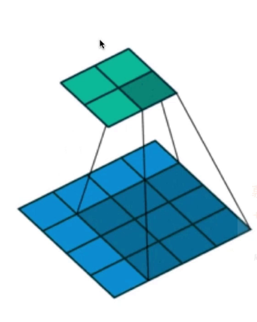
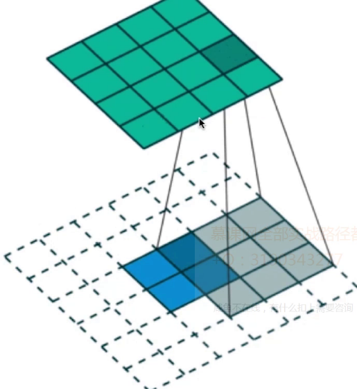

# 生成对抗网络 Generative Adversarial Network        

>  Goodfellow在2014年提出,他曾是Yoshua Bengio的学生      

> Yan LeCun 称赞GAN是"过去十年机器学习领域最有意思的想法"    

这个网络需要同时训练两个模型，一个能够捕获数据分布的生成模型G，一个能够估计数据来源于真实样本概率的判别模型D     

生成器G的训练过程是最大化判别器犯错误的概率，即判别器误以为数据是真是样本而不是生成器生成的假样本，因此这个网络就对应于两个参与者的极小极大博弈(minmax game), 在所有可能的函数G和D中，我们可以求出唯一均衡解，即G可以生成与训练样本相同的分布，而D判断的概率处处为1/2     

## 极小极大博弈      

为了学习到生成器在数据x上的分布P_g,我们先定义一个先验的输入噪声变量p_z(z),然后根据G(z;w_g)将其映射到数据空间中，其中G为生成器对应的可微函数，同时需要定义第二个网络D(s;w_d),它的输出为单个标量，**D(x)表示x来源于真是数据而不是P_g的概率**，我们训练D以最大正确分配真实样本和生成样本的概率，因此我们可以通过最小化log(1-D(G(z)))而同时训练G，也就是说判别器D和生成器G对价值函数V(G,D)进行极小极大博弈     

我们训练判别器D，让它在判别真实数据P_data时总是得到接近于1的结果，判别G生成的数据P_g时总是得到较差的结果，也就是接近于0      


其实极小极大博弈可以分开来看，即在给定G的情况下先最大化V(D,G)而获得D，然后固定D，并最小化V(D,G)而得到G，其中，给定G，最大化V(D,G)评估了P_g和P_data之间的差异或距离       


## DCGAN(Deep Convolutional Generative Adversarial Network)    
         

### 反卷积和卷积    

* 卷积   
        
    从图中的下层计算得到上层的操作   
    从矩阵运算的角度思考,将输入的4x4图像展开成16x1的矩阵X,然后将卷积核运算也展开,是4x16的一个矩阵C,卷积操作就是$Y = CX$,得到4x1的一个输出   

* 反卷积     
      
    对下层的2x2的单元进行padding,因为输出是4x4,所以做两个单位的padding,然后使用3x3的卷积核,步长为1   
    反卷积是卷积的逆过程,上面卷积的输入是4x4,输出是4x1    
    反卷积的输入就是4x1,输出是16x1     
    从矩阵运算的角度思考,反卷积操作就是$Y = C^TX$,这里X是输入4x1,$C^T$是卷积核运算展开C的转置,size为16x4,最后就可以得到反卷积输出为16x1    


### 模型结构     

* 1.Pooling层使用Convolution层代替(因为是从随机的少量数据来生成图片,使用池化层会丢失信息)     
    * D上使用strided convolution     
    * G上使用fractional-strided convolution(间隔关键点反卷积层)
        fractional-strided convolution也可以叫做deconvolution       

* 2.G和D都是用batch normailzation   
    * 可以帮助解决初始化数据较差的问题  
    * 可以使梯度传播到每一层,防止出现梯度弥散现象   
    * BN不应用于输入层和输出层(调参经验)       
    * 在D中移除了全连接层,采用了像ResNet中的global pooling    
    * G上除了输出层使用tanH以外其他都是用Relu     
    * D上使用leakyRelu,leakyRelu的斜率为0.2       

## 训练细节   

* 除了将图像像素值规划到[-1, 1]之间为了tanh激活函数做准备之外没有其他的预处理      
* 所有模型都使用mini-batch stochastic gradient desent(SGD)训练,mini-batch的大小是128    
* 所有的参数被初始化都使用0为均值,0.02为标准方差的标准正态分布       
* LeakyReLU的斜率为0.2     
* 之前的GAN使用动量加快收敛速度,这里使用Adam optimizer,learning_rate使用0.0002,动量参数β1使用0.5        

## 测试    

* LSUN   
    paper中提到在Large-scale Scene Understanding数据集上选取了至少三百万张图片进行训练   

* 论文中一直在强调DCGAN是真正学习到了语义特征而不是只是记住了图片,通过调整初始输入向量来探索隐空间是如何影响最终图像的生成,还可以观察到图像特征是如何折叠到隐空间中的      


 
### 生成器    

* 生成器网络有4个卷积层，除输出层外，其他所有层都紧接着批归一化(BN)和线性修正单元(ReLU)进行激活      

* 生成器将随机向量z(从正态分布中抽取)作为输入，向量z进行四维重塑后，送入生成器，启动一系列上采样层       

* 每个上采样层都代表了一个步长为2的转置卷积运算符，转置卷积运算与常规卷积运算类似         

* 常规卷积运算的层从宽而浅到窄而深，而转置卷积恰好相反：其层从窄而深到宽而浅       

* 转置卷积运算操作的步长定义了输出层的大小，在使用`same`填充时，步长为2时，输出特征图的尺寸将是输出层的大小的两倍         

* 将3x3的卷积核在2x2的输入上进行步长为2的转制卷积操作，相当于将3x3的卷积核在5x5的输入上进行步长为2的常规卷积操作        

            

* 窄而深的输入向量是生成器的开始，在每次转置卷积之后，z变得更加宽而浅，所有转制卷积都使用5x5的卷积核，输入z深度由512降到3，这里的3代表RGB彩色图像的三个通道         

    ```python
    def transpose_conv2d(x, output_space):
        return tf.layers.conv2d_transpose(x, output_space,
            kernel_size=5, strides=2, padding='same', 
            kernel_initializer=tf.random_normal_initializer(mean=0.0, stddev=0.02)
        )
    ```    

* 最后一层输出一个32x32x3的tensor，并使用tanH函数将值压缩到-1到1之间      

    最终的输出尺寸有训练集图像的大小确定，如果使用Mnist数据集进行训练，则会生成28x28的灰度图像     


