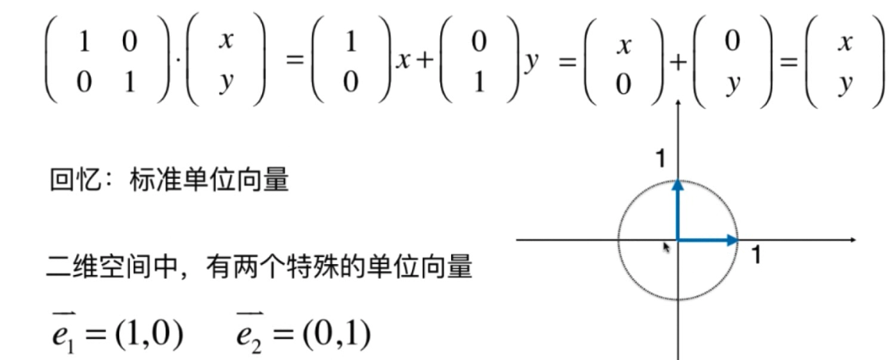
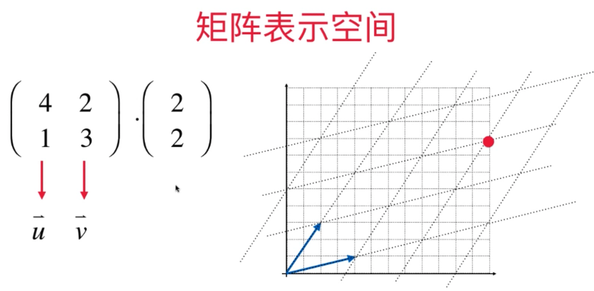
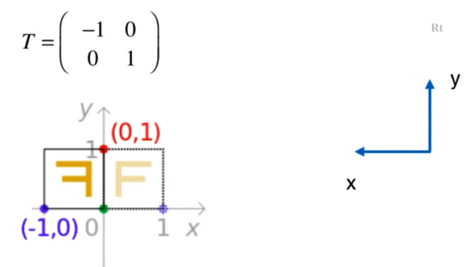
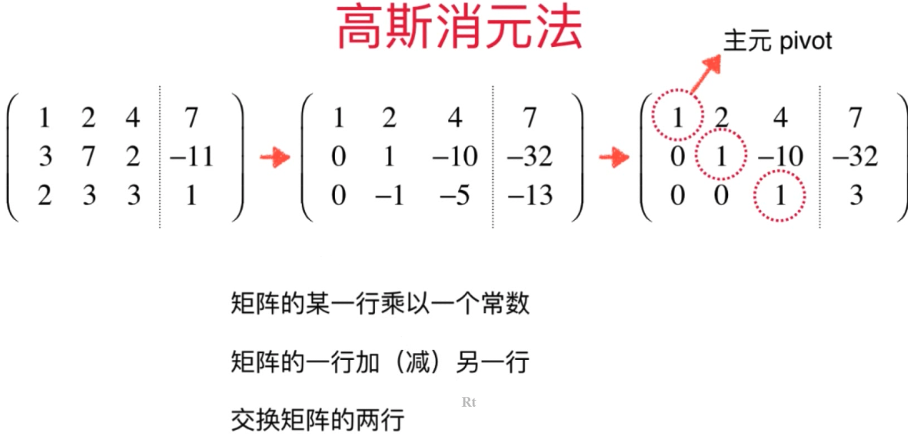

# 线性代数   

## [矩阵实现及相关变换](./getLA/Matrix.py)   

* 四则运算   
* 矩阵相关属性(形状，转置)      
* 矩阵乘法     
* 单位矩阵        

## [矩阵在图形学中的应用](./main_matrix_transformation.py)    

* 缩放变换   
* 沿坐标轴反转   
* 错切变换   
* 旋转变换   

## [矩阵性质与应用](./getLA/Matrix.py)        
* 单位矩阵   

    **单位矩阵一定是方阵**   
    **$A^{0} = I$**  
    
* 矩阵的逆   

    矩阵中$AB = BA = I$,则称B是A的逆矩阵，记做：$B=A^{-1}$   
    A称为可逆矩阵(大多数)，或者叫非奇异矩阵(non-singular)   
    **可逆矩阵一定是方阵**   
    有些矩阵是不可逆的，称为奇异矩阵(singular)      

    * 性质   
        * 若一个矩阵存在其的逆矩阵，该逆矩阵是唯一的    
        * $(A^{-1}) ^ {-1} = A$     
        * $(A  B) ^ {-1} = B^{-1}A^{-1}$   
            该性质与矩阵转置中的性质类似：  
            $(A B)^{T} = B^{T}A^{T}$       
            并且有种特殊的矩阵，其转置就等于其逆     
        * $(A^{T})^{-1} = (A^{-1})^{T}$       

* 矩阵表示空间    

    对于一个矩阵，如果我们从将其按照一列一列的视角看待，可以将每个列向量看作是一个空间中的一个单位向量，然后由这些单位向量就构成了一个图形空间，下图是使用列视角对标准二维空间(欧几里得空间)进行分析：    

          

    如果将左侧的矩阵看作一个图形空间，那右边与它相乘的向量就可以看作是该空间的一个点，矩阵乘法后的结果为$xe_1 + ye_2$，这就是该点在该空间中的定义。        

    下面来看一个更加一般的情况，假设这里表示空间的矩阵是一个任意矩阵，而不是一个单位阵或者其他具有特殊性质的矩阵：    

        

    仍然从列的视角观察，两个单位向量分别为u和v，在图中就是两个蓝色向量，然后将这两个向量的平行向量扩展就得到一个新的空间，该空间相对于背景中的欧几里得空间是完全不同的，在该空间矩阵右侧乘上一个向量(2, 2),表示将向量(2，2)表示的点放入到左侧矩阵构成的一个空间中，矩阵乘法的结果为(12, 8)表示该点在标准二维空间的坐标为(12, 8)。      

    * 图形变换   
        
        根据上面矩阵能够表示空间这种观察视角，这里再来分析一下图形变换中的各种转换矩阵，其实完全可以将这些转换矩阵看作是一个个新的图形空间，这些空间的单位向量就是矩阵中的每个列向量。     

            

        上图中为图形学中沿着y轴反转的变换，这里将转换矩阵T看做是一个新的空间，新的空间如右侧所示，然后图形变换就成了将原始空间中的每个点放置到新的空间中的一个变换，如右侧所示。    

    * **矩阵表示空间时，该矩阵应该是一个方阵**     

        n维空间应该用n个轴来定义，也就是用n维方阵来表示。     
          

## 线性系统       

* 高斯消元法       

       

    首先将方程组写成增广矩阵形式，然后执行线性变化，将矩阵每行的主元位置(主元位置为第i行的第i列)化简成1，**主元之前的所有元素都为0**.     

    *三个基本矩阵操作为*：   
    * 矩阵的某一行乘以一个常数     
    * 矩阵的一行加(减)另一行    
    * 交换矩阵的两行 

    *缺点*：     
    * 当化简完成后，最后一行的主元位置为1，且其之前的所有元素都为0，根据此，可以直接得到方程组中最后一个未知数的取值，然后还需要根据这个未知数的值向上回代到其他的方程中求剩余的几个未知数的值，有什么办法可以直接在矩阵化简之后，直接将所有的未知数的值读出来，这就要用到下面的**高斯-约旦消元法**。     

* 

    

 

