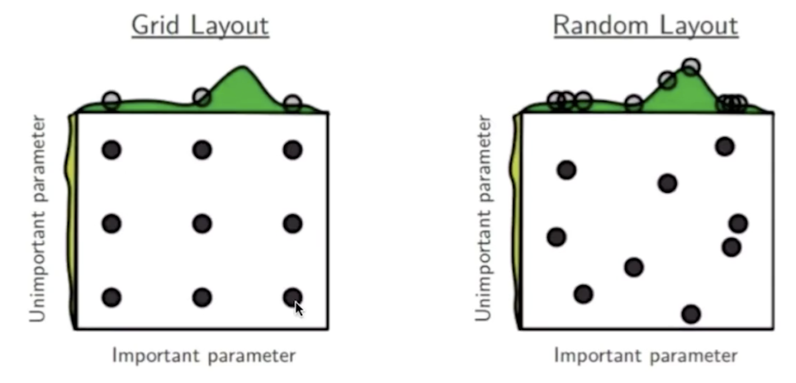

## One-Hot编码     

One-Hot编码就是将一个表示类别的标量转换为一个向量，在进行多分类时会用到。     

* (x1,y1) = ([10,3,4,20,...4], 3)
* y1' = Model(x1) = [0.1,0.2,0.25,0.4,0.05]   

这里y的预测值都可以看作是概率形式，为了方便计算loss，需要将标签的形式统一为这种预测的形式      

* Loss = abs(y1 - y1') = [0,0,0,1,0] - y1' = [0.1,0.2,0.25,0.6,0.05] = 1.2     

* 这里将y1=3直接转换为one-hot编码[0,0,0,1,0],就是将类别3索引上的值赋值为1，其余位置赋值为0         

## 损失函数分类    

### 平方差损失    

直接使用最小二乘法计算真实值与预测值的距离    

$$
1/n \Sigma_{x,y} (y - Model(x)) ^ 2   
$$    

### 交叉熵损失     

该函数用来衡量两个分布之间的差距     

$$
1/n \Sigma_{x,y} yLn(Model(x))    
$$   

### 学习率对神经网络训练的影响    

     

### 训练前Shuffle的作用   

开了Shuffle就是随机梯度下降,不开就是梯度下降,当数据量足够大时,没有开shuffle的神经网络会把相邻example的顺序也学习到,造成误差 

## 超参数搜索   
### 网格搜索   
每个超参数给定一组候选值，多组超参数可以构成一个高维网格，然后分别使用每个网格上确定的超参数集合来训练模型，最后模型效果最好的超参数即为最优超参数，其中训练可以并行处理      

    

### 随机搜索   
网格搜索中给定的候选超参数都是离散值(固定值)，如果当前模型的超参数正好是两个离散值之间，那使用网格搜索是无论如何都无法寻找到的，这时可以使用随机搜索，即给定每个超参数一个搜索范围，然后多组超参数即可构成一个高维空间，然后在这个高维空间中随机生成超参数候选点，余下操作与网格搜索相同，下图右侧为随机搜索   

    

### 基于遗传算法的超参数搜索   
* 对自然界的模拟(物竞天择)    
* 1.初始化候选参数集合 -> 训练 -> 得到模型指标作为生存概率    
* 2.选择 -> 交叉 -> 变异 -> 产生下一代集合   
* 3.返回步骤1   

### 启发式搜索   
* 是目前AutoML中的一个研究热点   
* 使用循环神经网络来生成超参数集合    
* 使用强化学习来反馈，使用模型来训练生成参数的循环神经网络，当该网络收敛后，就可以从该网络获得最优超参数集合    

