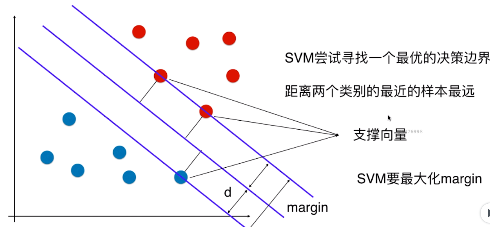
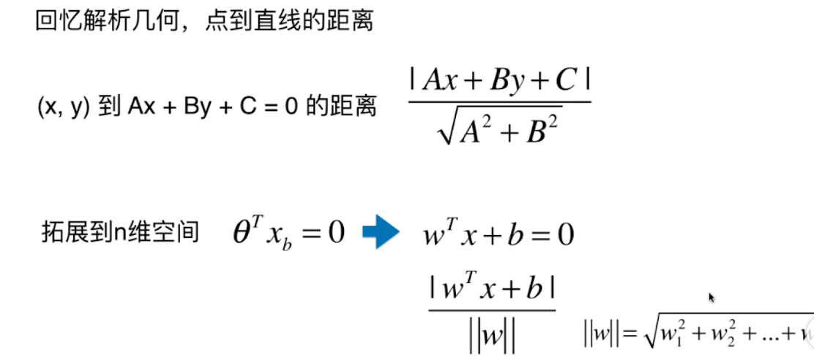

## 什么是支持向量机     

在分类问题中，如果采用一般的决策边界算法，很有可能最后的分类器的泛化性很差           

        

### 线性可分      

就是说我们把数据样本投射到高维空间后，存在一个超平面将数据集正实例点和负实例点完全正确的划分到超平面的两侧，就称这个数据集是线性可分数据集。    

### Hard Margin SVM     
线性可分支持向量机，其实就是求解`margin`最大时的那条直线或者超平面，因为`margin = 2d`,`d`又是正例和负例中最边界的点到超平面的距离，所以问题就转换为一个最优化距离问题。       

先看一下在二维空间中，点到直线的距离问题(根据毕达哥拉斯定理)           

        

### Soft Margin SVM     

    

