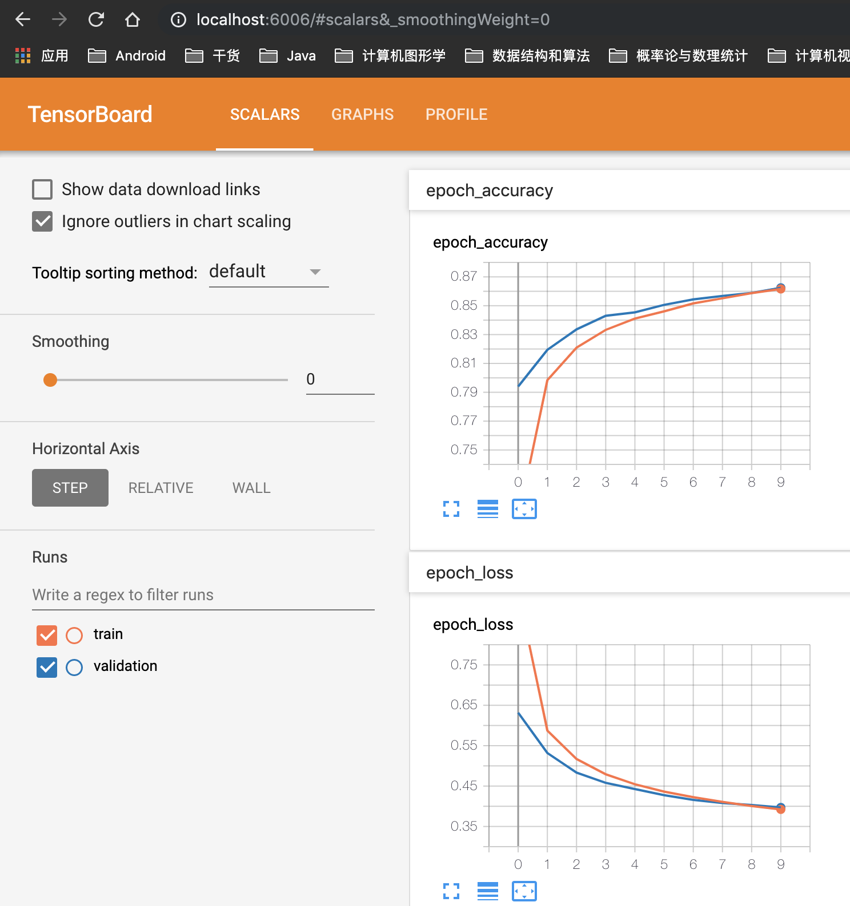

## Tensorflow-Keras    

### [Keras实现分类模型](./tf_keras_classification_model.ipynb)     

* Keras构建模型流程    

    ```python
    # tf.keras.models.Sequential()

    model = keras.models.Sequential()
    model.add(keras.layers.Flatten(input_shape=[28, 28]))
    model.add(keras.layers.Dense(300, activation='relu'))
    model.add(keras.layers.Dense(100, activation='relu'))
    # 输出层为10，使用softmax将向量转换为概率分布
    model.add(keras.layers.Dense(10, activation='softmax'))

    # 这里的y是单个数值，当y是one-hot编码时，loss='categroical_crossentropy'
    model.compile(loss='sparse_categorical_crossentropy',
                optimizer='sgd',
                metrics=['accuracy'])
    ```   

* 模型训练    

    ```python
    # 训练，结束后会返回一个History对象    
    # 分别传入训练数据和验证数据集， epochs参数指定模型在整个训练集上的迭代次数
    # 每个epoch结束后，模型会在validation_data上评估一次，模型不会在该数据上训练
    log_his = model.fit(X_train, y_train, epochs=10, verbose=1, validation_data=(X_valid, y_valid))
    ```   

### [Keras实现模型(加入相关callbacks)](./tf_keras_classification_model_normalize_callbacks.ipynb)     

* 添加callbacks：TensorBoard, EarlyStopping, ModelCheckpoint     

    ```python
    # tensorboard需要指定一个log dir
    log_dir = './callbacks'
    if not os.path.exists(log_dir):
        os.mkdir(log_dir)
    # ModelCheckpoint需要指定一个保存模型数据的文件名
    output_model_file = os.path.join(log_dir, 'fashion_mnist_model.h5')
        
    callbacks = [
        keras.callbacks.TensorBoard(log_dir),
        keras.callbacks.ModelCheckpoint(output_model_file, save_best_only=True),
        # 默认监测数据为验证集上的loss(val_loss)，min_delta值表示被监测数据的最小变化量
        # patience表示等待几次监测数据没有提升，在这之后，训练将被终止
        keras.callbacks.EarlyStopping(patience=5, min_delta=1e-3)
    ]

    log_his = model.fit(X_train_scaled, y_train, epochs=10, validation_data=(X_valid_scaled, y_valid),
                    callbacks=callbacks)
    ``` 

* 开启Tensorflow服务   

    在终端中切换到callbacks目录，输入命令`tensorboard --logdir=dir名称`，服务默认端口号6006    

       


### [Keras构建回归模型](./tf_keras_regression.ipynb)     

模型搭建过程类似与分类模型    
