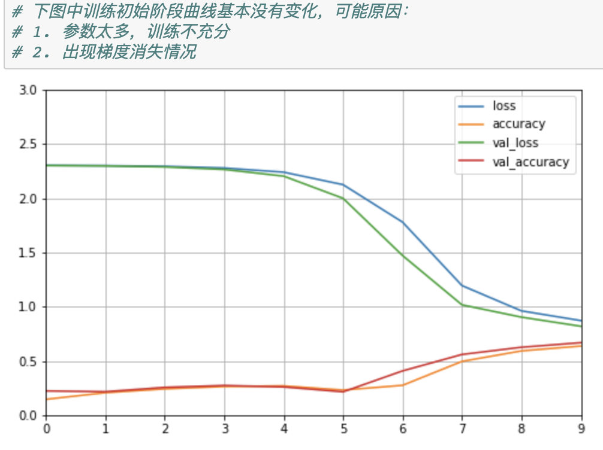

## Tensorflow-Keras    

### [Keras实现分类模型](./tf_keras_classification_model.ipynb)     

* Keras构建模型流程    

    ```python
    # tf.keras.models.Sequential()

    model = keras.models.Sequential()
    model.add(keras.layers.Flatten(input_shape=[28, 28]))
    model.add(keras.layers.Dense(300, activation='relu'))
    model.add(keras.layers.Dense(100, activation='relu'))
    # 输出层为10，使用softmax将向量转换为概率分布
    model.add(keras.layers.Dense(10, activation='softmax'))

    # 这里的y是单个数值，当y是one-hot编码时，loss='categroical_crossentropy'
    model.compile(loss='sparse_categorical_crossentropy',
                optimizer='sgd',
                metrics=['accuracy'])
    ```   

* 模型训练    

    ```python
    # 训练，结束后会返回一个History对象    
    # 分别传入训练数据和验证数据集， epochs参数指定模型在整个训练集上的迭代次数
    # 每个epoch结束后，模型会在validation_data上评估一次，模型不会在该数据上训练
    log_his = model.fit(X_train, y_train, epochs=10, verbose=1, validation_data=(X_valid, y_valid))
    ```   

### [Keras实现模型(加入相关callbacks)](./tf_keras_classification_model_normalize_callbacks.ipynb)     

* 添加callbacks：TensorBoard, EarlyStopping, ModelCheckpoint     

    ```python
    # tensorboard需要指定一个log dir
    log_dir = './callbacks'
    if not os.path.exists(log_dir):
        os.mkdir(log_dir)
    # ModelCheckpoint需要指定一个保存模型数据的文件名
    output_model_file = os.path.join(log_dir, 'fashion_mnist_model.h5')
        
    callbacks = [
        keras.callbacks.TensorBoard(log_dir),
        keras.callbacks.ModelCheckpoint(output_model_file, save_best_only=True),
        # 默认监测数据为验证集上的loss(val_loss)，min_delta值表示被监测数据的最小变化量
        # patience表示等待几次监测数据没有提升，在这之后，训练将被终止
        keras.callbacks.EarlyStopping(patience=5, min_delta=1e-3)
    ]

    log_his = model.fit(X_train_scaled, y_train, epochs=10, validation_data=(X_valid_scaled, y_valid),
                    callbacks=callbacks)
    ``` 

* 开启Tensorflow服务   

    在终端中切换到callbacks目录，输入命令`tensorboard --logdir=dir名称`，服务默认端口号6006    

       


### [Keras构建回归模型](./tf_keras_regression.ipynb)     

模型搭建过程类似与分类模型      

### [Keras构建深度神经网络](./tf_keras_classification_model_dnn.ipynb)     

    

### Wide & Deep Model      

2016年发布，用于分类和回归，应用到了Google Play中的App推荐   
**Wide&Deep模型的核心思想是结合线性模型的记忆能力和DNN模型的泛化能力，从而提升总体模型性能**     

* 稀疏特征    
    离散值特征，比如人的性别信息，并且使用One-hot表示   
    如：专业={计算机、人文、其他}，计算机=[1, 0, 1]    

    * 特征叉乘(cross-product)    
        * 稀疏特征做叉乘后可以获取更多的共现信息，其实就是各种特征之间的组合     

        * 实现记忆的效果，比较极端的情况是将所有特征叉乘起来，这相当于纯粹记住每个训练样本，这是最细粒度的叉乘，可以通过构造更粗粒度的特征叉乘来增强泛化性     

    * 优缺点     

        *优点*   
        在工业界已被证明是有效的    

        *缺点*    
        * 需要很多的人工特征设计   
        * 容易出现过拟合，尤其是特征大量叉乘时，模型容易记住所有的样本   
        * 泛化能力较差，无法捕捉训练数据中未曾出现过的特征对    
* 密集特征     
    向量表达，比如词向量的表示，在一个词典中S={...我，你，他...},我={0.3, 0.4, 0.7,...}    

    * 优缺点    

        *优点*   
        * 向量带有语义特征，不同向量之间具有相关性     
        * 可以兼容数据集中没有出现过的特征组合    
        * 更少人工参与      

        *缺点*       
        * 过度泛化时，会推荐错误的产品      

* [Wide-Deep模型函数式API实现](./tf_keras_regression_wide_deep.ipynb)     
    ```python
    # 模型构建,使用keras 函数式Api
    input_layer = keras.layers.Input(shape=X_train.shape[1:])
    # 定义好层，后面括号中填入输入参数
    # 这里的hidden相当于是deep模型
    hidden1 = keras.layers.Dense(30, activation='relu')(input_layer)
    hidden2 = keras.layers.Dense(30, activation='relu')(hidden1)

    # 将wide和deep模型合并然后进行输出层处理，这里的wide模型直接以输入inputs代替
    concat = keras.layers.concatenate([input_layer, hidden2])
    output = keras.layers.Dense(1)(concat)

    # 上面只是将模型的层数固定好，但是并没有实现模型的固化
    model = keras.models.Model(inputs=[input_layer],
                            outputs=[output])

    model.summary()
    model.compile(loss='mean_squared_error', optimizer='sgd')
    callbacks = [keras.callbacks.EarlyStopping(patience=5, min_delta=1e-2)]
    ```
* [keras子类实现](./tf_keras_regression_wide_deep_subclass.ipynb)    
    ```python
    # 继承keras.models.Model
    class WideDeepModel(keras.models.Model):
        def __init__(self):
            # 先调用父类构造函数
            super(WideDeepModel, self).__init__()
            """定义模型的层次,然后可以以函数调用的方式来调用这些层次"""
            self._hidden1_layer = keras.layers.Dense(30, activation='relu')
            self._hidden2_layer = keras.layers.Dense(30, activation='relu')
            self._output_layer = keras.layers.Dense(1)
            
        def call(self, input):
            """完成模型的正向传播"""
            hidden1 = self._hidden1_layer(input)
            hidden2 = self._hidden2_layer(hidden1)
            concat = keras.layers.concatenate([input, hidden2])
            output = self._output_layer(concat)
            return output

    # 定义模型对象
    model = WideDeepModel()
    # build用来指定模型输入的shape,相当于定义模型的输入层 model.add(keras.layers.Input(input_shape=[None, 8]))
    model.build(input_shape=(None, 8))

    model.summary()
    model.compile(loss='mean_squared_error', optimizer='sgd')
    callbacks = [keras.callbacks.EarlyStopping(patience=5, min_delta=1e-2)]
    ```
* [keras多输入实现](./tf_keras_regression_wide_deep_multi_input.ipynb)    


    

          
            

    


