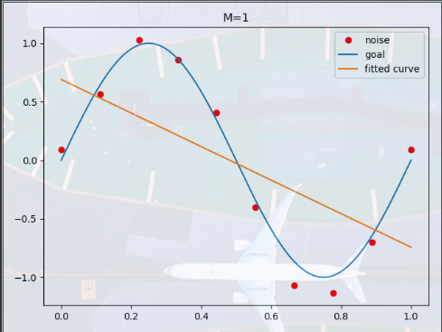
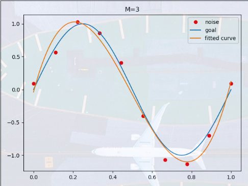
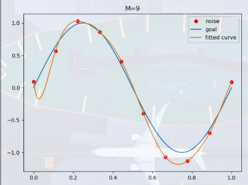

# 统计学习方法概论   

## 问题的类型    

* 输入变量和输出变量都为连续变量的预测问题称为回归问题   

* 输出变量为有限个离散变量的预测问题称为分类问题   

* 输入变量和输出变量都为变量序列的预测问题为标注问题      

## 联合概率分布   

统计学习假设数据存在一定的统计规律，监督学习假设输入和输出的随机变量$X$和$Y$遵循联合概率分布$P(X, Y)$,$P(X, Y)$表示分布函数或者分布密度函数，**在模型的学习过程中，假定这一联合概率分布存在**   


监督学习的模型可以是概率模型或者非概率模型，由条件概率分布$P(Y|X)$或者决策函数(decision function)$Y=f(X)$表示，随具体的学习方法而定，对于具体的输入进行相应的输出预测时，写作$P(y|x)或者y=f(x)$，x和y小写表示具体的值     

## 统计学习三要素   

`方法 = 模型 + 策略 + 算法`      

### 模型    

首先要考虑的是学习什么样的模型，这里的模型可以直接看成上面提到的条件概率分布或者决策函数   

由**决策函数表示的模型为非概率模型，由条件概率表示的模型称为概率模型**     

### 策略     

分为经验风险最小化和结构风险最小化    

* 经验风险最小化(empirical risk minimization)    

    经验风险是**相对于一个训练数据集**的平均损失     

    所以按照经验风险最小化策略求最优模型就是求解最优化问题：   

    $$\frac{1}{N}\sum_{i=1}^{N}L(y_i, f(x_i))$$    

    当样本容量较大时，经验风险最小化策略可以保证很好的学习效果，比如，极大似然估计(maximum likelihood estimation)就是经验风险最小化的一个例子     

    但是，当样本的容量很小时，容易出现过拟合现象(over-fitting)    
* 结构风险最小化(structural risk minimization)    

    该策略是针对于过拟合现象提出的，在原有经验风险最小化的基础上加上了针对具体模型的正则化项或者惩罚项      

    结构风险的定义：   

    $$\frac{1}{N}\sum_{i=1}^{N}L(y_i,f(x_i)) + \lambda{J(f)}$$     

    其中$J(f)$表示模型的复杂度，复杂度表示了对复杂模型的惩罚，$\lambda >= 0$是系数，用来权衡经验风险和模型复杂度      


## 模型评估和模型选择    

### 训练误差和测试误差       

* 训练误差的大小反映出给定的问题是否是一个容易学习的问题    

* 测试误差反映了当前学习方法对于未知的测试数据集的预测能力，这个测试能力通常称为泛化能力(generalization ability)     

### 过拟合和模型选择     

为了一味追求对训练数据的预测能力，无疑会提高模型的复杂程度，随之带来的是模型的参数增多，这将导致模型对于已知数据预测的很好，但是对于未知数据的预测很差，这种现象就是过拟合(over-fitting)    

**可以说模型选择旨在避免过拟合并提高模型的预测能力**    

下面使用一个多项式函数拟合实例来说明过拟合和模型选择      

假设给定一个训练数据集:   

$$T = \{(x_1, y_1),(x_2, y_2),...,(x_N, y_N)\}$$   

假定给定10个数据点，这10个数据点符合$sin(2\pi x)$分布，然后给每一个观测点加上了一个高斯分布的随机噪声，再使用$M$次多项式对这10个数据点进行拟合    

设$M$次多项式为：   

$$f_M(x, \omega) = \omega_0 + \omega_1x + \omega_2x^2 + ... + \omega_Mx^M = \sum_{j=0}^{M}\omega_jx^j$$      

该式中$x$为单变量输入，$\omega_M$是M+1个参数     

首先先确定模型的复杂度，即确定多项式的次数，然后根据得到的模型复杂度，按照经验风险最小化策略，求解参数，就是多项式各项的系数(包括常数项)   


使用最小二乘法求得令残差平方和最小的模型参数     

> 高斯于1823年证明了最小二乘法的一个最优性质：在所有无偏的线性估计类中，最小二乘法方法具有最小的方差    

最优化下式：   

$$min\sum_{i=1}^{N}(\sum_{j=0}^{M}\omega_jx_i^j - y_i)^2$$  

```python  
def goal_fun(x):
    """
    目标函数
    :param x:
    :return: 目标函数设置为y = sin2Πx
    """
    return np.sin(2 * np.pi * x)


def fit_fun(p, x):
    """
    多项式函数
    eg: np.poly1d([1, 2, 3])生成1x^2 + 2x^1 + 3x^0
    :param p: 各次项前面的系数或者说是权重
    :param x:
    :return:
    """
    f = np.poly1d(p)
    return f(x)


def residual_fun(p, x, y):
    """
    计算残差
    :param p:
    :param x:
    :param y: y为观测值(真实值)
    :return:
    """
    res = fit_fun(p, x) - y
    return res


def fitting(x, y, x_points, M=0):
    """
    使用最小二乘法进行拟合并进行可视化
    :param x: 观测点的x坐标
    :param y: y坐标
    :param x_points: 可视化的x坐标
    :param M: 最高次数
    :return:
    """
    # 随机初始化多项式各项系数, M+1表示有一个常数项
    p = np.random.rand(M + 1)
    # 最小二乘法， 传入残差计算函数
    p_lsq = leastsq(residual_fun, p, args=(x, y))
    print('fitting param:', p_lsq[0])

    # 可视化
    plt.title('M={}'.format(M))
    plt.plot(x, y, 'ro', label='noise')
    plt.plot(x_points, goal_fun(x_points), label='goal')
    plt.plot(x_points, fit_fun(p_lsq[0], x_points), label='fitted curve')
    plt.legend()
    plt.show()
    return p_lsq


if __name__ == '__main__':
    # 给定10个数据点
    x = np.linspace(0, 1, 10)
    y_ = goal_fun(x)
    # 给10个坐标点加入随机噪声
    y = [i + np.random.normal(0, 0.1) for i in y_]
    # 可视化点x坐标
    x_points = np.linspace(0, 1, 1000)
    # M = 0
    p_lsq_0 = fitting(x, y, x_points, M=0)
    # M = 1
    p_lsq_1 = fitting(x, y, x_points, M=1)
    # M = 3
    p_lsq_3 = fitting(x, y, x_points, M=3)
    # M = 9
    p_lsq_9 = fitting(x, y, x_points, M=9)
```    

M=1的拟合结果：    
     

M=3的拟合结果：   
  

M=9的拟合结果：  
    

* 分析     

    * M=1时拟合效果并不好，原因是模型较为简单，参数较少，无法描述训练数据集     

    * M=9时，多项式曲线可以通过每一个数据点，训练误差为0，数据拟合的效果是最优的，但是因为训练数据有随机噪声，这种模型对于未知数据的预测能力很差，容易发生过拟合现象     

    * M=3时，多项式曲线对训练数据的拟合效果足够好，而且模型也比较简单，实际的效果较好      

    * **模型在选择时，不仅要考虑模型对已知数据的预测能力，还有考虑对未知数据的预测能力**    

    * 随着多项式次数(模型复杂度)的增加，训练误差会逐渐减小，一直趋近于0，但是测试误差会先减小然后再增大，**但是我们的目标是让训练误差较小时，测试误差也较小，这就需要用到模型的选择方法**  


### 正则化和交叉验证   

