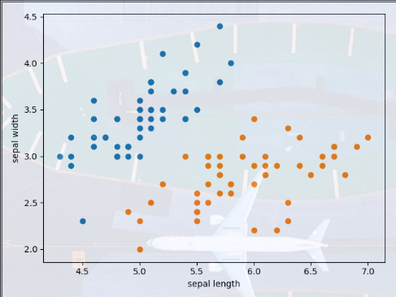
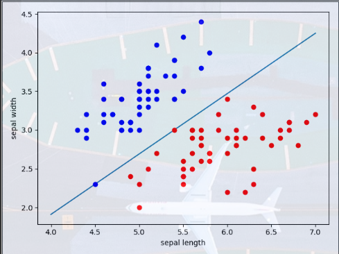
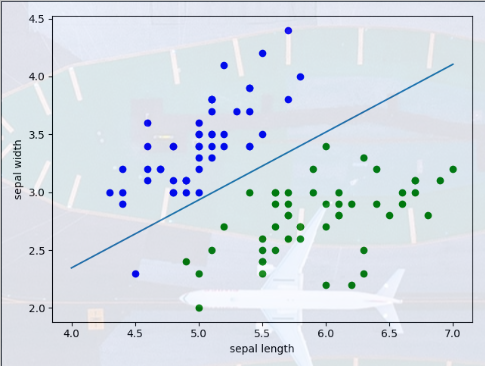

# 感知机(Perceptron)     

感知机是面向二分类的线性分类模型，输入为样本实例的特征向量，输出只有两个值,-1和1，表示输入实例的类别。        

在几何意义上来看，感知机对应于在输入空间(特征空间)将实例划分为正负两类的一个超平面,为了找到最佳的划分平面，需要导入错误分类的损失函数，训练使该损失函数极小化，就可以求得感知机模型。    

感知机模型分为原始形式和对偶形式，1957年由Rosenblatt提出，感知机模型是神经网络和支持向量机的基础模型。     

## 感知机模型    

假设输入x为样本的特征向量，对应于特征空间中的一点，输出y表示该样本的类别，感知机就是从输入x到输出y的一个函数：   

$$f(x) = sign(\omega{x} + b)$$     

其中`ω`和`x`是感知机模型的参数，`ω`是权值(weight)或者权值向量(weight vector),`b`是偏置项(bias)     

`sign`是符号函数：   

$$
sign(x) = \left\{\begin{aligned}
+1 & & x \ge 0 \\  
-1 & & x < 0
\end{aligned}
\right. 
$$      

感知机模型的假设空间是由定义在特征空间中的所有线性分类模型构成的，所以线性划分方程：   

$$\omega{x} + b = 0$$     

对应于特征空间中的一个超平面，其中`w`是超平面的法向量，`b`是超平面的截距，将特征空间划分为两个区域。   

## 损失函数   

### 数据集的线性可分性    

上面提到感知机模型可以看作是特征空间中的一个划分平面，所以这里首先来介绍一下数据集的线性可分性     

给定一个数据集:   

$$T = {(x_1, y_1), (x_2, y_2),...,(x_N, y_N)}$$   

其中`xi`位于该数据集构成的特征空间中，`y={-1, +1},i = 1,2,...,N`，如果存在某个超平面S可以将该数据集中所有的正类点和负类点完全正确的划分到超平面的两侧，就称为该数据集T为线性可分数据集(linearly separable data set).   


### 学习策略   

为了找到合适的超平面，首先要导入一个能够描述错误分类的函数，而且这个函数需要是模型参数`w和b`的连续可导函数，方便优化。    

这里使用误分类点到超平面S的总距离来构造损失函数  

输入空间中任一点x0到超平面S的距离为：  

$$\frac{1}{||\omega||}|\omega{x_0} + b|$$   

这里`||ω||`是`ω`的`L2`范数       

光凭一个距离还是无法较好的表征分类预测的确信程度，所以这里引入了函数间隔(functional margin)  

* 函数间隔    

    对于一组样本来说，如果分类超平面`ωx+b=0`已经确定，`|ωx+b|`能够表示点x距离超平面的远近，而`ωx+b`的符号与类标记的y的符号是否一致能够表示分类是否正确。   

    所以可以使用`y(ωx+b)`来表示分类的正确性及确信度，这就是函数间隔(functional margin)  

这里考虑对错误分类的数据点，当`ωx+b>0`时，因为是错误分类，所以`yi=-1`，而当`ωx+b<0`时，`yi=+1`,所以错误分类点`xi`到超平面的距离是：  

$$-\frac{1}{||\omega||}y_i(\omega{x_i} + b)$$   

假设错误分类的点集合为M，那所有错误分类点到超平面S的总距离为：   

$$-\frac{1}{||\omega||}\sum_{x_i\in{M}}y_i(\omega{x_i} + b)$$    

然后得到感知机学习的损失函数:   

$$L(\omega,b) = -\sum_{x_i \in {M}}y_i(\omega{x_i} + b)$$   

这个损失函数就是感知机学习经验风险函数    

## 学习算法   

感知机模型学习算法转换为求解损失函数的最优化问题，使用随机梯度下降法(stochastic gradient descent)      

最优化下式：   

$$min_{\omega, b}L(\omega,b) = -\sum_{x_i \in M}y_i(\omega{x_i}+b)$$   

其中M为误分类点集合，求解最优参数`ω`和`b`    

损失函数L(ω，b)的梯度为：   

$$\bigtriangledown_{\omega}L(\omega,b) = -\sum_{x_i \in M}y_ix_i$$  

$$\bigtriangledown_{b}L(\omega, b) = -\sum_{x_i \in M}y_i$$  

然后随机选取一个误分类点，对两个参数进行更新：   

$$\omega = \omega + \eta{y_ix_i}$$   

$$b = b + \eta{y_i}$$   

其中`η`为学习率(learning rate)，通过调整两个参数的值，使超平面向误分类点的一侧移动，直到误分类点被正确分类。   

使用scikit-learn中的`iris`中的两个类别并且只取两个特征(sepal length, sepal width)实现一个感知机模型    

```python
def preprocess(df):
    """
    对传入的数据进行预处理
    取100组样本数据，并将X和y分离，将y值规范化为1和-1
    :param df:
    :return:
    """
    # 进行sepal length和sepal width两个特征的可视化
    # iris数据集中标签有三种0，1，2，每种各有50个样本，按照标签升序排列
    # 这里先绘制标签为0的50个样本

    plt.scatter(df[:50]['sepal length'], df[:50]['sepal width'], label='0')
    # 这里绘制标签为1的50个样本
    plt.scatter(df[50:100]['sepal length'], df[50:100]['sepal width'], label='1')
    plt.xlabel('sepal length')
    plt.ylabel('sepal width')
    plt.show()

    # 将前100个样本分离出来，并进行X和y的初始化
    # 只取前两个特征和标签数据
    data = np.array(df.iloc[:100, [0, 1, -1]])
    X = data[:, :50]
    y = data[:, 50:]
    # 将y进行规范化
    y = np.array([1 if i == 1 else -1 for i in y])
    return X, y
```  

样本数据可视化：    
  

感知机模型   

```python
class Perceptron:
    def __init__(self, data):
        # 初始化参数
        self.w = np.ones(len(data[0]) - 1, dtype=np.float32)
        self.b = 0
        self._learning_rate = 0.1

    def sign(self, X, w, b):
        y = np.dot(X, w) + b
        return y

    def fit(self, X_train, y_train):
        """
        随机梯度下降
        :param X_train:
        :param y_train:
        :return:
        """
        is_fitting = False
        while not is_fitting:
            fitting_count = 0
            for i in range(len(X_train)):
                X = X_train[i]
                y = y_train[i]
                if self.sign(X, self.w, self.b) * y < 0:
                    # 进行参数的更新
                    self.w = self.w + self._learning_rate * np.dot(y, X)
                    self.b = self.b + self._learning_rate * y
                    fitting_count += 1
            if fitting_count == 0:
                is_fitting = True
        print("Model fitting finished")
        return is_fitting


def train(data, X_train, y_train):
    """
    进行模型的训练和结果可视化
    :param X_train:
    :param y_train:
    :return:
    """
    perceptron = Perceptron(data)
    perceptron.fit(X_train, y_train)

    # 训练结束得到分隔直线的系数
    x_points = np.linspace(4, 7, 10)
    # 分隔直线方程为w1*x + w2*y + b = 0
    # 为了绘制，将y提到方程左边，所以方程变为下式
    y_ = -(x_points * perceptron.w[0] + perceptron.b) / perceptron.w[1]
    plt.plot(x_points, y_)

    plt.plot(X_train[:50, 0], X_train[:50, 1], 'bo', label='sepal length')
    plt.plot(X_train[50:, 0], X_train[50:, 1], 'ro', label='sepal width')
    plt.xlabel('sepal length')
    plt.ylabel('sepal width')
    plt.show()


if __name__ == '__main__':
    iris = load_iris()
    df = pd.DataFrame(iris.data, columns=iris.feature_names)
    df['label'] = iris.target
    df.columns = ['sepal length', 'sepal width', 'petal length', 'petal width', 'label']
    data, X, y = preprocess(df)
    train(data, X, y)
```  

模型分类结果：  

   

## Scikit-learn中的Perceptron   

这里使用sklearn中的感知机模型对上面的实例进行分类   

```python
from sklearn.linear_model import Perceptron as skPerceptron
model = skPerceptron(fit_intercept=False, max_iter=1000, shuffle=False)
    model.fit(X, y)
    # 可视化
    x_points = np.linspace(4, 7, 10)
    y = -(model.coef_[0][0] * x_points + model.intercept_) / model.coef_[0][1]
    plt.plot(x_points, y)
    plt.plot(X[:50, 0], X[:50, 1], 'bo', label='0')
    plt.plot(X[50:, 0], X[50:, 1], 'bo', color='green', label='1')
    plt.xlabel('sepal length')
    plt.ylabel('sepal width')
    plt.show()
```  

分类结果：  

  

## 总结   

感知机模型存在很多解，这些解和初始化参数的值，训练过程中误分类点的选择顺序有关，为了得到唯一的分隔超平面，就需要增约束条件，这正是支持向量机的算法思想。     

